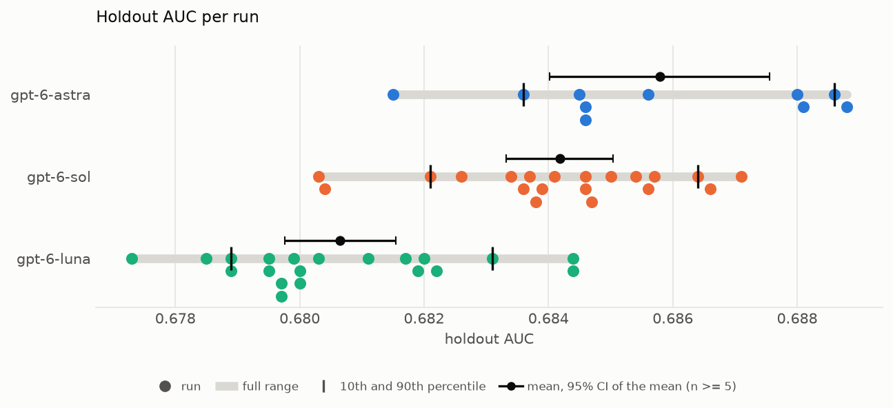

# Optimizing XGBoost Machine Learning Models with AI Agents: Runs

**TL;DR:** Runs [xgboost-autoresearch-minimal3](https://github.com/szilard/xgboost-autoresearch-minimal3) (an AI coding agent autonomously tunes an XGBoost model, and its gains are then checked on a holdout set it never sees) with various agents/LLMs, once or repeatedly, fully automated. Repeated runs show how much the result of the same agent/LLM varies from run to run.

This is the orchestrator for [xgboost-autoresearch-minimal3](https://github.com/szilard/xgboost-autoresearch-minimal3), itself a follow-up to [xgboost-autoresearch](https://github.com/szilard/xgboost-autoresearch).
Another follow-up project is [identical-runs-different-results](https://github.com/earino/identical-runs-different-results) and the corresponding [arXiv paper](https://arxiv.org/abs/2609.33812).

How a run works (the task, the agent's loop and the guardrails are described in the [xgboost-autoresearch-minimal3 README](https://github.com/szilard/xgboost-autoresearch-minimal3)):

- **Isolation:** each run gets a fresh Docker container (`agents3` image) with a clean copy of `xgboost-autoresearch-minimal3` at a pinned commit: no history and no earlier results, so the agent cannot see previous runs. The human-only files (the `human/` scripts and the holdout set) are not in the agent's copy at all: the image keeps them readable by root only, and they are copied back for the scoring after the agent has exited. Only the agent's login is shared with the container.
- **Agent:** currently codex, on a ChatGPT subscription (OpenAI models, at a chosen reasoning effort, e.g. `max`). It gets the prompt from the `xgboost-autoresearch-minimal3` README and then works on its own for 1 hour, enforced by the harness clock; the orchestrator only sends "go" to start and "keep going" if it stops early.
- **Holdout check:** after the run, every kept model is scored on the holdout set (`holdout_scores.tsv`, `auc_history.png`).
- **Validity checks:** the model and effort actually used (from the agent's session log), and two kinds of rule checks.
  - *Integrity:* nothing but `train.py` changed (the agent's own logs in `output/` aside), every kept result comes from a harness run inside the clock, `train.py` reads no data other than `train.csv`, no flight data fetched from elsewhere, and no content of the holdout set, the eval set or the human-only scripts in the agent's commands and outputs. Runs that fail one are recorded as excluded.
  - *Protocol:* the rules of the agent's loop, such as the keep rule (never keep a lower eval AUC), discarded experiments actually reset, the clock not stopped early. Runs that break one stay valid, with a caveat.

  The eval/holdout gap is reported for every run.
- **Orchestration:** by Claude Code, with the project skill `/xgb-multi <group> <model> <n-runs> [effort]`: N sequential runs of the same setup (N = 1 for a single run), each driven identically by a script, results in `run-multi/<group>/<group>-<i>/`, plus a group `results_summary.md` (with mean/sd/min/median/max over the valid runs) and `holdout_auc.tsv` (one line per run, for plots such as histograms). Claude reviews each run and writes up the results.

Each run's folder has the agent's `results.tsv` and `research-log.md`, the `train.py` of the best kept commit, the holdout scores and plot, the harness timing report, the rule checks (`checks.txt`, `leak_check.txt`), the git log, the agent's session log (gzipped, with the encrypted reasoning dropped and account ids redacted) and a `run.md` with the settings, the turns sent, the validity checks and anything notable.

## Results so far

<!-- xgb-summary: start (the block up to the end marker is rewritten by /xgb-summary) -->
20 runs per model, all with codex-cli 0.160.0 at effort max, a 24 GB container memory cap and minimal3 at `5fb023a`. Holdout AUC of each run's best model (by eval AUC; on a tie the last kept commit), over the valid runs, including those with a caveat; the starter `train.py` scores 0.6725:

| model | groups | valid runs | excluded | holdout AUC mean | sd | min | median | max |
|---|---|---|---|---|---|---|---|---|
| gpt-6-astra | [astra6_n20](run-multi/astra6_n20/results_summary.md) | 20 (3 with caveat) | 0 | 0.6866 | 0.0022 | 0.6815 | 0.6871 | 0.6906 |
| gpt-6-sol | [sol6_n20](run-multi/sol6_n20/results_summary.md) | 20 (3 with caveat) | 0 | 0.6842 | 0.0018 | 0.6803 | 0.6844 | 0.6871 |
| gpt-6-luna | [luna6_n20](run-multi/luna6_n20/results_summary.md) | 20 (4 with caveat) | 0 | 0.6806 | 0.0019 | 0.6773 | 0.6800 | 0.6844 |

Ten runs carry a caveat; the plots draw them like any other run. Nine are `keep_rule` (commits kept at an equal Eval AUC without being simpler or faster): luna6_n20-6, -8, -15, -18, sol6_n20-8, -19 and astra6_n20-5, -8, -12. One is `turn_retries` (the waits after failed turns, with the model at capacity, took more than 2 minutes out of the hour): sol6_n20-16. No run was excluded. All three groups are complete. luna6_n20-1, -7, -11, -15, sol6_n20-12 and astra6_n20-15 are valid with a `train_py_review` flag, explained in their `run.md`: a false match of the word "global" in the first five, an allowed read of `data/train.csv` in astra6_n20-15. astra6_n20-4 and -16 are valid with an `artifact_outside_clock` flag, explained in their `run.md`: in both the artifact is from a harness run inside the clock that left no timing row of its own (in -4 the last run, cut off before it finished; in -16 a discarded run whose timing row got the wrong commit after a bookkeeping slip by the agent). The test group test1 was moved to `archive/` and is not included. All valid runs have the same settings.

<!-- xgb-summary: end -->

Plots over all groups go to `run-multi/SUMMARY/`:

- `holdout_auc_beeswarm.png`: one dot per run, a grey bar over the full range, the 10th/90th percentiles and the mean with its 95% confidence interval per model;
- `holdout_auc_pairwise.png`: head to head - the probability that one run of a model beats one run of another, with a 95% bootstrap interval;
- `holdout_auc_path_panels.png`, `holdout_auc_path_median.png`: the holdout AUC of the kept model over the time of the run (minutes since its clock started) - per run in one panel per model, and all runs faded with the medians in bold.

A run with a caveat is drawn like any other run, unless its kind of caveat is set to be marked: then its dot is hollow and its path dashed. Each kind is decided once, when it first turns up (`CAVEAT_MARKED` and `CAVEAT_PLAIN` in `tools/plot_holdout_auc.py`); a tie kept without being simpler or faster is not marked.

They are made by `tools/plot_holdout_auc.py` (beeswarm and paths) and `tools/pairwise_win_prob.py` (head to head; it also prints the table), which read every group's `holdout_auc.tsv` and pool groups of the same model. The project skill `/xgb-summary` runs them, checks the group files and the plots, and rewrites the table above (`tools/summary_table.py`).

## Machine and setup

Recommended machine: m8i.2xlarge (8 cores, 32 GB RAM). The per-run time limits depend on the hardware, so compare results only across runs on the same machine type. Runs are sequential, since each uses all cores.

Setup and usage: [setup/README.md](setup/README.md).

License: [MIT](LICENSE). Web content quoted in the archived session logs remains the property of its owners.
